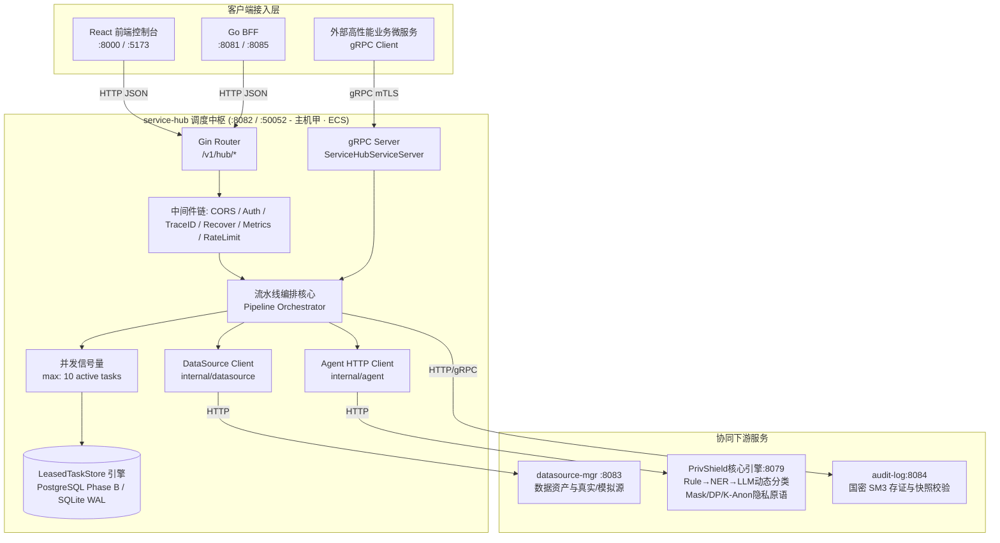
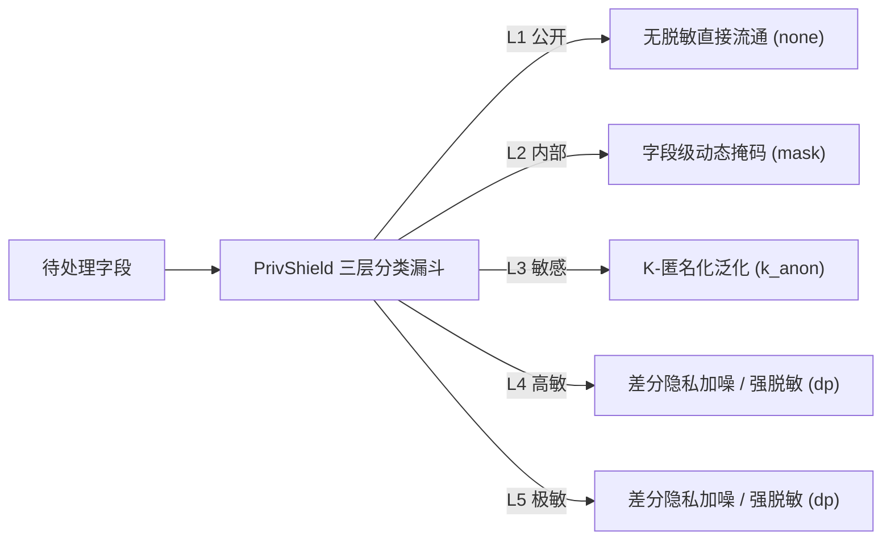
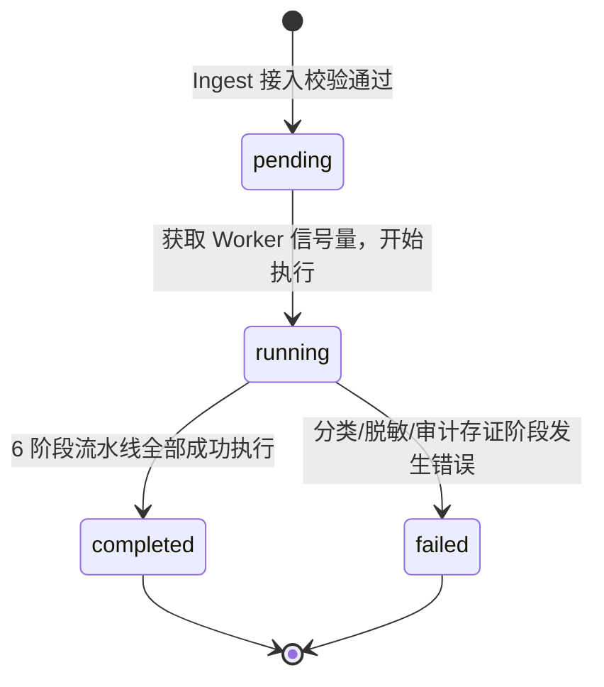
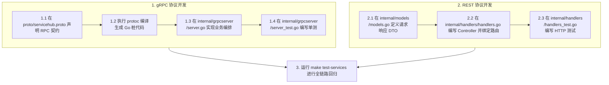

# 数据服务调度中枢 (service-hub) 深度学习指南

> 面向研发、运维与架构师的完整技术指南，深入解析数联天下 · 数盾 (`PrivShield`) 调度中枢模块的系统架构、六阶段数据流水线、双协议并发、零信任安全与核心源码实现。

---

## 目录 / Table of Contents

- [1. 模块全景与业务定位](#1-模块全景与业务定位)
- [2. 系统架构与拓扑图解](#2-系统架构与拓扑图解)
- [3. 六阶段数据流通调度流水线](#3-六阶段数据流通调度流水线)
- [4. 核心代码架构与目录结构](#4-核心代码架构与目录结构)
- [5. 核心源码深入解读](#5-核心源码深入解读)
  - [5.1 服务启动入口与生命周期 (cmd/server/main.go)](#51-服务启动入口与生命周期-cmdservermaingo)
  - [5.2 配置驱动加载 (internal/config/config.go)](#52-配置驱动加载-internalconfigconfiggo)
  - [5.3 HTTP 路由与并发调度控制 (internal/handlers/handlers.go)](#53-http-路由与并发调度控制-internalhandlershandlersgo)
  - [5.4 上游 Agent 客户端与熔断机制 (internal/agent/client.go)](#54-上游-agent-客户端与熔断机制-internalagentclientgo)
  - [5.5 数据源客户端 (internal/datasource/client.go)](#55-数据源客户端-internaldatasourceclientgo)
  - [5.6 gRPC 服务与零信任 mTLS / 公钥固定 (internal/grpcserver/server.go)](#56-grpc-服务与零信任-mtls--公钥固定-internalgrpcserverservergo)
    - [5.7 gRPC 桩代码与服务端实现的核心关联 (servicehub_grpc.pb.go vs server.go)](#57-grpc-桩代码-servicehub_grpcpbgo-与服务端实现-servergo-的核心关联)
- [6. 任务存储引擎与状态机流转](#6-任务存储引擎与状态机流转)
- [7. 零信任安全防护体系](#7-零信任安全防护体系)
- [8. 本地开发、实操与自动化测试](#8-本地开发实操与自动化测试)
- [9. 生产环境部署与监控](#9-生产环境部署与监控)
- [10. 常见问题排查 (FAQ)](#10-常见问题排查-faq)
- [11. 实战演练：如何新增一个调度通信 API（REST & gRPC 双协议全流程）](#11-实战演练如何新增一个调度通信-apirest--grpc-双协议全流程)
  - [11.1 gRPC 接口开发步骤](#111-grpc-接口开发步骤)
  - [11.2 HTTP REST 接口开发步骤](#112-http-rest-接口开发步骤)

---

## 1. 模块全景与业务定位

在企业数据安全治理与数据要素流通场景中，业务数据在不同部门、机构之间流转时，必须经过严密的**合规授权、敏感探查、动态脱敏与防篡改存证**。

**`service-hub` (数据服务调度中枢)** 是整个 `PrivShield` 系统的数据中枢中台微服务，扮演“业务编排大脑”的角色：

```
┌───────────────────────────────────────────────────────────────────────────┐
│                      上游调用方 (Web 控制台 / BFF / 外部业务系统)           │
└─────────────────────────────────────┬─────────────────────────────────────┘
                                      │ HTTP REST (:8082) / gRPC (:50052)
                                      ▼
┌───────────────────────────────────────────────────────────────────────────┐
│                    service-hub 调度中枢 (Go 1.25+ / Gin / gRPC)            │
│                                                                           │
│   • 接入认证与校验  • 任务生命周期管理  • 动态分类决策  • 隐私策略映射        │
└───────────┬─────────────────────────┬──────────────────────────┬──────────┘
            │ HTTP                    │ HTTP / gRPC              │ HTTP / gRPC
            ▼                         ▼                          ▼
┌──────────────────────────┐ ┌──────────────────────────┐ ┌──────────────────────────┐
│ datasource-mgr (:8083)   │ │ PrivShield 引擎 (:8079)  │ │  audit-log (:8084)       │
│ 数据源资产与模拟数据抽取   │ │ 三层分类漏斗与脱敏原语     │ │ 国密 SM3 存证与合规报告  │
└──────────────────────────┘ └──────────────────────────┘ └──────────────────────────┘
```

### 核心职责与设计目标

1. **统一任务流编排**：对外提供原子化任务调度与端到端自动化流水线（Pipeline）。
2. **多微服务协同**：横向联动数据源管理 (`datasource-mgr`)、隐私计算 Agent (`PrivShield`) 与审计存证 (`audit-log`)。
3. **双协议暴露与互通**：对外提供面向 Web UI 的 HTTP RESTful API (:8082)，以及面向后端服务高吞吐、低延迟调用的 gRPC API (:50052)。
4. **金融级零信任传输**：支持 TLS 1.3 / 国密 SM2 双向认证（mTLS）、证书 CN 白名单鉴权，杜绝中间人攻击与伪造证书。
5. **生产级高可用与弹性存储**：支持 PostgreSQL Phase B 多副本原子租约（带自适应连接池与 3s 探针自动降级）及 SQLite WAL 持久化引擎。

---

## 2. 系统架构与拓扑图解



---

## 3. 六阶段数据流通调度流水线

调度中枢将每一个完整的数据治理流抽象为 6 个有序阶段；其中 `classify` 执行一体化分类与脱敏，`audit` 执行出域存证（P0-6 fail-closed），`desensitize` / `return` 为兼容的状态追踪标签。

```
① ingest (接入) ──▶ ② fetch (取数) ──▶ ③ classify（分类与脱敏处理） ──▶ ④ desensitize（状态追踪） ──▶ ⑤ return（状态追踪） ──▶ ⑥ audit（出域存证） ──▶ done
```

| 序号 | 阶段标识 (`stage`) | 具体动作 | 协同模块与关键实现 |
|---|---|---|---|
| **1** | `ingest` | 任务已由 HTTP 或 gRPC `Dispatch` 创建为 `pending/queued`；流水线随后写入 `running/ingest` | `internal/handlers/handlers.go`: `Dispatch` / `processTask` |
| **2** | `fetch` | 数据源拉取阶段保留，分页抽取接口已移除，需由调用方在提交任务时携带载荷 | `internal/datasource/client.go`: `Health` / `ListDataSources` / `GetDataSource` |
| **3** | `classify` | 调用 Agent `POST /v1/agent/process`，404 时回退 `POST /v1/medical/process`；一次完成分类与脱敏 | `internal/agent/client.go`: `ProcessAgent` |
| **4** | `desensitize` | 不执行独立脱敏调用；处理已在 `classify` 一体化完成 | `processTask` 状态机快速流转 |
| **5** | `return` | 当前为状态追踪标签，不组装或持久化额外结果对象 | `processTask` 状态机快速流转 |
| **6** | `audit` | 调用 `submitEvidence` 向 audit-log 提交出域存证（`POST /v1/audit/logs`）；提交失败即任务 `failed`（P0-6 fail-closed），成功后写入 `completed/done` | `internal/audit/client.go` + `processTask` → `submitEvidence` |

### 敏感度等级与隐私原语自动映射策略

gRPC `ClassifyAndDispatch` 会先调用 Agent `Classify` 评估敏感度，再将等级映射为任务 `operation`；创建后的异步任务仍在 `classify` 标签通过一体化处理接口完成分类与脱敏：



---

## 4. 核心代码架构与目录结构

`services/service-hub` 采用 Go 标准微服务分层结构设计，零冗余、职责清晰：

```text
services/service-hub/
├── cmd/
│   └── server/
│       └── main.go              # 服务启动入口、并发监听、优雅关闭
├── internal/
│   ├── config/                  # 环境变量配置加载与校验
│   │   ├── config.go
│   │   └── config_test.go
│   ├── agent/                   # PrivShield Agent 客户端封装 (HTTP)
│   │   ├── client.go
│   │   └── client_test.go
│   ├── audit/                   # audit-log 出域存证客户端封装 (P0-6)
│   │   ├── client.go
│   │   └── client_test.go
│   ├── datasource/              # datasource-mgr 客户端封装
│   │   ├── client.go
│   │   └── client_test.go
│   ├── retry/                   # 失败任务可重试判定与指数退避
│   │   ├── retry.go
│   │   └── retry_test.go
│   ├── grpcserver/              # gRPC 服务端实现、Scope 鉴权与 TLS/mTLS 凭证构造
│   │   ├── auth.go              # gRPC 方法级 Scope 鉴权拦截器
│   │   ├── server.go
│   │   └── server_test.go
│   ├── handlers/                # HTTP REST 控制层与 Pipeline 编排逻辑
│   │   ├── handlers.go
│   │   ├── handlers_test.go
│   │   └── real_e2e_test.go     # 全链路端到端集成测试
│   └── models/                  # 业务实体模型与状态定义
│       ├── models.go
│       └── models_test.go
├── proto/                       # gRPC Protobuf 定义与生成代码
│   ├── servicehub.proto
│   ├── servicehub.pb.go
│   └── servicehub_grpc.pb.go
├── docs/                        # SDLC 设计与学习文档
│   ├── prd.md
│   ├── design.md
│   ├── api.md
│   ├── ops.md
│   ├── testing.md
│   ├── reliability.md
│   └── learning-guide.md        # 本学习文档
├── Dockerfile                   # 多阶段轻量镜像构建
└── Makefile                     # 常用编译与测试指令
```

---

## 5. 核心源码深入解读

### 5.1 服务启动入口与生命周期 (`cmd/server/main.go`)

`cmd/server/main.go` 负责统一初始化全模块依赖，以**双协程**方式并发启动 HTTP REST 与 gRPC 服务器，并通过 OS 信号处理机制实现优雅关闭。

```go
func main() {
    // 1. 加载配置、一致性校验与结构化日志
    cfg := config.Load()
    if err := cfg.Validate(); err != nil {
        log.Fatalf("invalid configuration: %v", err)
    }
    logger := pkgconfig.SetupLogger(cfg.LogFormat, cfg.LogLevel)

    // 2. 数据库完整性校验与任务存储引擎初始化（支持 Memory 或 SQLite WAL）
    if cfg.DBPath != "" {
        if err := sqlite.ValidateIntegrity(cfg.DBPath); err != nil {
            log.Fatalf("sqlite integrity check failed: %v", err)
        }
    }
    taskStore, err := initTaskStore(cfg.DBPath, logger)
    if err != nil {
        log.Fatalf("failed to initialize task store: %v", err)
    }

    // 3. 初始化 Prometheus 指标收集器
    mc := metrics.NewCollector("service-hub")

    // 4. 崩溃恢复与自动重试（孤立任务回收 + 失败任务指数退避重试）
    recoverOrphanedTasks(taskStore, mc, logger)
    retryFailedTasks(taskStore, mc, logger)

    // 5. 启动后台周期性重试与数据保留清理协程
    retryCtx, retryCancel := context.WithCancel(context.Background())
    go periodicRetryLoop(retryCtx, taskStore, mc, logger, 60*time.Second)
    if cfg.RetentionDays > 0 {
        retentionCtx, retentionCancel := context.WithCancel(context.Background())
        go dataRetentionLoop(retentionCtx, taskStore, logger, cfg.RetentionDays)
    }

    // 6. 实例化下游客户端组件
    agentClient := agent.New(cfg)
    dsClient := datasource.New(cfg)

    // 7. 初始化 Gin REST 路由器与 Slowloris 超时加固 HTTP Server (支持可选 mTLS)
    server := handlers.New(agentClient, dsClient, cfg, keyStore, taskStore, logger, mc)
    router := gin.New()
    server.RegisterRoutes(router)

    httpSrv := &http.Server{
        Addr:              cfg.Address(),
        Handler:           router,
        ReadHeaderTimeout: 5 * time.Second,  // 防范 Slowloris 请求头拒绝服务攻击
        ReadTimeout:       30 * time.Second,
        WriteTimeout:      60 * time.Second,
        IdleTimeout:       120 * time.Second,
        MaxHeaderBytes:    1 << 20, // 1 MiB 最大请求头
    }

    // 8. 启动 gRPC 服务（根据配置选择安全 mTLS 或 Insecure 模式，支持 SPKI Pinning）
    // ...

    // 9. 注册 SIGINT / SIGTERM 信号监听，启动优雅关闭
    sigChan := make(chan os.Signal, 1)
    signal.Notify(sigChan, syscall.SIGINT, syscall.SIGTERM)
    <-sigChan

    // 10. 优雅关停：先取消后台协程与任务 Context，再顺序关闭 gRPC 与 HTTP
    server.Shutdown()
    grpcServer.GracefulStop()
    httpSrv.Shutdown(shutdownCtx)
    taskStore.Close()
}
```

### 5.2 配置驱动加载 (`internal/config/config.go`)

所有运行时参数均通过环境变量注入，并提供安全的本地开发默认值：

| 环境变量 | 默认值 | 作用说明 |
|---|---|---|
| `SERVICE_HUB_HOST` | `127.0.0.1` | HTTP REST 服务监听地址 |
| `SERVICE_HUB_PORT` | `8082` | HTTP REST 服务监听端口 |
| `SERVICE_HUB_GRPC_HOST` | `127.0.0.1` | gRPC 服务监听地址 |
| `SERVICE_HUB_GRPC_PORT` | `50052` | gRPC 服务监听端口 |
| `PRIVACY_AGENT_REST_HOST` | `127.0.0.1` | 上游 PrivShield Agent 主机名 |
| `PRIVACY_REST_PORT` | `8079` | 上游 PrivShield Agent REST 端口 |
| `PRIVACY_AGENT_API_KEY` | `""` | 上游 PrivShield Agent 访问 API Key |
| `PRIVACY_AGENT_URLS` | `""` | 多 Agent 负载均衡/故障转移地址列表 |
| `SERVICE_HUB_MAX_QUEUE` | `1000` | 调度引擎最大任务排队深度 |
| `SERVICE_HUB_SCHEDULE_TIMEOUT` | `30` | 任务单步调度与执行超时（秒） |
| `DATASOURCE_MGR_HOST` | `127.0.0.1` | 数据源管理服务主机名 |
| `DATASOURCE_MGR_PORT` | `8083` | 数据源管理服务端口 |
| `DATASOURCE_MGR_GRPC_HOST` | `127.0.0.1` | 数据源管理服务 gRPC 主机名 |
| `DATASOURCE_MGR_GRPC_PORT` | `50053` | 数据源管理服务 gRPC 端口 |
| `SERVICE_HUB_TLS_ENABLED` | `false` | 是否开启 HTTP/gRPC TLS/mTLS 加密通信 |
| `SERVICE_HUB_TLS_CERT_FILE` | `""` | 服务端 X.509 证书文件路径 |
| `SERVICE_HUB_TLS_KEY_FILE` | `""` | 服务端私钥文件路径 |
| `SERVICE_HUB_TLS_CA_FILE` | `""` | 验证客户端证书的根 CA 证书文件路径 |
| `SERVICE_HUB_TLS_CLIENT_AUTH` | `""` | 客户端证书模式：`require` / `verify` / `request` |
| `SERVICE_HUB_TLS_PINNED_PUBKEY_FILE` | `""` | 允许的客户端公钥哈希白名单文件 (SPKI Pinning) |
| `SERVICE_HUB_API_KEY` | `""` | 本模块对外暴露的入站 API Key 鉴权 |
| `SERVICE_HUB_CORS_ORIGINS` | `""` | 允许跨域的 CORS 域名白名单 |
| `SERVICE_HUB_DB_PATH` | `""` (内存) | 任务持久化 SQLite 路径（非空时启用 WAL 持久化） |
| `SERVICE_HUB_RETENTION_DAYS` | `30` | 终态任务数据保留天数（0 表示禁用清理） |
| `SERVICE_HUB_SHUTDOWN_TIMEOUT` | `5` | 优雅关机等待超时秒数 |
| `SERVICE_HUB_LOG_FORMAT` | `json` | 结构化日志格式: `json` / `text` |
| `SERVICE_HUB_LOG_LEVEL` | `info` | 日志输出级别: `debug` / `info` / `warn` / `error` |

### 5.3 HTTP 路由与并发调度控制 (`internal/handlers/handlers.go`)

`Server` 结构体持有业务组件依赖，并通过 `taskSem` 信号量 channel 控制同一时刻并发执行的重量级任务数量（默认容量 10），防止突发流量耗尽 Agent 算力。

```go
type Server struct {
    agent      *agent.Client      // 上游 PrivShield Python Agent 客户端
    datasource *datasource.Client // 下游 datasource-mgr 数据源服务客户端
    cfg        *config.Config     // 模块全局运行配置
    startTime  time.Time          // 服务启动时间戳
    tasks      store.TaskStore    // 任务持久化存储介质
    logger     *slog.Logger       // 结构化日志记录器
    mc         *metrics.Collector // Prometheus 监控指标收集器
    taskSem    chan struct{}      // 信号量通道（最大 10 并发）
    ctx        context.Context    // 广播取消信号的父 Context
    cancel     context.CancelFunc // 取消函数
    wg         sync.WaitGroup     // 跟踪执行中的后台任务协程
}

func (s *Server) RegisterRoutes(r *gin.Engine) {
    // 挂载通用中间件链
    r.Use(middleware.TraceMiddleware())                  // 全链路追踪（X-Request-ID + X-Trace-ID）
    r.Use(pkgobs.RequestLoggerWithModule("service-hub")) // 结构化访问日志
    r.Use(middleware.Recovery(s.logger, "service-hub"))
    r.Use(middleware.WAF(s.logger))                      // 三级等保 G-12：Web 攻击载荷检测
    r.Use(middleware.SecurityHeaders())
    r.Use(middleware.MaxBodySize(32 << 20))              // 32 MiB 请求体上限
    r.Use(middleware.MaxConcurrent(1000))                // 并发在途请求上限，超限返回 503
    if s.cfg.RateLimitRPS > 0 {
        r.Use(middleware.RateLimit(s.cfg.RateLimitRPS, s.cfg.RateLimitBurst)) // 每客户端 IP 令牌桶限流
    }
    r.Use(middleware.CORS(s.cfg.CORSOrigins))
    r.Use(s.scopeAuthMiddleware()) // Scope-based 鉴权（hub:read / hub:dispatch），向后兼容单 API Key

    // 基础健康检查与服务概览
    r.GET("/health", s.Health)     // Liveness probe / 存活探针
    r.GET("/readyz", s.Readyz)     // Readiness probe / 就绪探针
    r.GET("/health", s.Health) // 兼容别名
    r.GET("/v1/hub/status", s.HubStatus)

    // 任务生命周期管理
    r.GET("/v1/hub/tasks", s.ListTasks)
    r.GET("/v1/hub/tasks/:id", s.GetTask)
    r.POST("/v1/hub/dispatch", s.Dispatch)
    r.POST("/v1/hub/classify", s.Dispatch) // 分类分级分发兼容别名

    // 按身份证号端到端查询+脱敏（同步）
    r.POST("/v1/hub/fetch-and-desensitize", s.FetchAndDesensitize)

    // 流水线状态
    r.GET("/v1/hub/pipeline", s.Pipeline)

    // Prometheus 监控指标导出
    r.GET("/metrics", s.mc.Handler())
}
```

### 5.4 上游 Agent 客户端与熔断机制 (`internal/agent/client.go`)

`agent.Client` 封装对 `PrivShield` Python 引擎的 HTTP 通信：
1. **自动超时控制**：调用方以 `context.WithTimeout` 约束请求。
2. **安全凭证传递**：底层共享客户端在配置后自动追加 API Key。
3. **预评估调用**：gRPC `ClassifyAndDispatch` 使用 `Classify(ctx, payload)` 请求 `POST /v1/dynclassification/eval_record`。
4. **一体化处理调用**：异步流水线使用 `ProcessAgent(ctx, records)` 请求 `POST /v1/agent/process`，404 时回退至 `POST /v1/medical/process`；该单次调用同时完成分类与脱敏。

### 5.5 数据源客户端 (`internal/datasource/client.go`)

当调用方发起请求时，`datasource.Client` 提供数据源元数据查询与健康检查能力：
- `GET http://127.0.0.1:8083/v1/datasources` 查询数据源列表。
- `GET http://127.0.0.1:8083/v1/datasources/:id` 查询单个数据源详情。
- 调用方需在提交任务时显式携带载荷数据，流水线不再自动抽取分页记录。

### 5.6 gRPC 服务与零信任 mTLS / 公钥固定 (`internal/grpcserver/server.go`)

`BuildServerCredentials` 实现了金融级零信任传输安全协议：
1. **强制最低 TLS 1.3**：禁用陈旧不安全的 TLS 1.0/1.1/1.2。
2. **客户端证书校验 (mTLS)**：当 `cfg.TLSClientAuth == "require"` 时，必须校验证书链。
3. **公钥固定 (SPKI Pinning)**：通过 `VerifyPeerCertificate` 回调函数，实时计算对端客户端证书的 `SHA-256(SubjectPublicKeyInfo)` 并比对白名单，即使 CA 证书泄露或被伪造，非法公钥的客户端依然会被立刻拦截！

```go
// 零信任公钥固定核心校验逻辑
config.VerifyPeerCertificate = func(rawCerts [][]byte, verifiedChains [][]*x509.Certificate) error {
    if len(rawCerts) == 0 {
        return fmt.Errorf("no client certificate provided")
    }
    cert, err := x509.ParseCertificate(rawCerts[0])
    if err != nil {
        return fmt.Errorf("failed to parse client certificate: %w", err)
    }
    // 计算客户端公钥 SHA-256 哈希
    pubKeyHash := sha256.Sum256(cert.RawSubjectPublicKeyInfo)
    pubKeyHashHex := hex.EncodeToString(pubKeyHash[:])
    
    // 比对白名单
    if !allowedKeys[pubKeyHashHex] {
        return fmt.Errorf("client public key pin verification failed: %s", pubKeyHashHex)
    }
    return nil
}
```

### 5.7 gRPC 桩代码 (`servicehub_grpc.pb.go`) 与服务端实现 (`server.go`) 的核心关联

在 `service-hub` 模块中，Protobuf 生成文件 `proto/servicehub_grpc.pb.go` 与服务端具体业务实现 `internal/grpcserver/server.go` 构成契约与实现的对应关系：

1. **接口契约 (Server Interface)**：
    `servicehub_grpc.pb.go` 中的 `ServiceHubServiceServer` 接口定义 `Health`、`HubStatus`、`Dispatch`、`ClassifyAndDispatch`、`GetTask`、`ListTasks`、`PipelineStatus` 与 `FetchAndDesensitize` 共 8 个 RPC 方法；
2. **方法分发器 (Dispatcher)**：
    `_ServiceHubService_Dispatch_Handler` 等内部函数负责反序列化 HTTP/2 网络帧，并转发给注册的服务端实例；
3. **业务落地实现 (Server Implementation)**：
    `internal/grpcserver/server.go` 中同名的 `(*GRPCServer)` 方法实现任务持久化、预分类自动分发、状态查询和流水线监控；异步流水线通过一次 `ProcessAgent` 调用完成分类与脱敏；
4. **生命周期绑定**：
   在 `cmd/server/main.go` 中通过 `pb.RegisterServiceHubServiceServer(grpcServer, serviceImpl)` 完成路由绑定与方法暴露。

---

## 6. 任务存储引擎与状态机流转

### 存储接口抽象 (`pkg/store/store.go`)

Service Hub 依赖统一抽象的 `store.TaskStore` 接口（定义于 `pkg/store/store.go`，任务实体为 `store.Task`，方法均不带 `context` 参数）：

```go
type TaskStore interface {
    Save(task *Task) error                       // 插入新任务或全量更新任务
    Get(id string) (*Task, error)                // 按任务 ID 查询详情，不存在返回错误
    List(filter TaskFilter) ([]Task, int, error) // 分页过滤查询，返回当前页切片与总记录数
    Update(task *Task) error                     // 更新现有任务的可变业务字段与状态
    Counts() (TaskCounts, error)                 // 聚合统计各状态的任务数量
    CleanupOld(before time.Time) (int64, error)  // 物理删除早于指定时间戳的终态任务
}
```

- **MemoryStore (`pkg/store/memory`)**：基于 `sync.RWMutex` + `map[string]*Task`，适用于轻量开发与单元测试。
- **SQLiteStore (`pkg/store/sqlite`)**：基于 `modernc.org/sqlite`（纯 Go 实现，无 CGO 依赖），开启 WAL 模式并发读写，持久化存储任务。

### 任务状态机流转



---

## 7. 零信任安全防护体系

1. **Slowloris 攻击防御**：在 `http.Server` 中显式设置 `ReadHeaderTimeout: 5s`，避免慢连接挂死服务连接池。
2. **传输层双向加密**：gRPC 原生支持 TLS 1.3 mTLS 双向认证。
3. **公钥固定 (SPKI Pinning)**：防止中间人攻击、未授权 CA 签发伪造证书。
4. **资源隔离与限流**：Goroutine 信号量限制并发执行数，防止大批量高密计算引起 OOM。
5. **Panic 恢复与结构化告警**：Gin Recovery 中间件捕获异常，防止单任务崩溃导致整个进程下线。

---

## 8. 本地开发、实操与自动化测试

### 8.1 快速启动与编译

```bash
# 进入 service-hub 目录
cd services/service-hub

# 方式 1: 直接本地启动（内存模式）
bash run.sh

# 方式 2: 使用根目录一键脚本启动微服务集群
bash scripts/dev/dev-start-new-modules.sh
```

### 8.2 核心 REST 接口演练

#### 1. 健康检查与就绪探针
```bash
curl -s http://127.0.0.1:8082/health | jq .
```

#### 2. 发起数据流通流水线任务 (`/v1/hub/dispatch`)
```bash
curl -s -X POST http://127.0.0.1:8082/v1/hub/dispatch \
  -H "Content-Type: application/json" \
  -d '{
        "source": "ds_yibao",
        "operation": "mask",
        "payload": {
            "patient_id": "P1001",
            "name": "张伟",
            "id_card": "110101199003072345",
            "phone": "13800138000",
            "diagnosis": "高血压二级",
            "fee": 1280.50
        }
  }' | jq .
```

#### 3. 运行自动化流水线模拟调度脚本
```bash
# 批量模拟注入 10 批次业务并发任务
bash services/service-hub/scripts/simulate-pipeline.sh 10
```

### 8.3 单元测试与 E2E 真实集成测试

```bash
# 1. 运行所有单元测试与短路径测试
go test -v ./internal/...

# 2. 运行真实全链路端到端集成测试（需要所有服务在后台运行）
PRIVSHIELD_E2E=1 go test -v -run TestRealE2E ./internal/handlers/
```

---

## 9. 生产环境部署与监控

### Docker 容器化构建

```bash
# 从项目根目录构建镜像
docker build -f services/service-hub/Dockerfile -t privshield-service-hub:1.8.0 .

# 独立运行容器并持久化 SQLite 数据
docker run -d \
  --name privshield-service-hub \
  -p 8082:8082 -p 50052:50052 \
  -v service-hub-data:/app/data \
  -e SERVICE_HUB_DB_PATH=/app/data/service-hub.db \
  -e PRIVACY_AGENT_REST_HOST=privshield \
  privshield-service-hub:1.8.0
```

### Prometheus 监控指标

访问 `http://127.0.0.1:8082/metrics` 即可采集标准 Prometheus 指标（所有 Go 服务共享 `pkg/metrics` 指标库，通过 `module` 标签区分服务）：
- `http_requests_total`：HTTP 请求总数（按 method/path/status 统计）
- `http_request_duration_seconds`：HTTP 请求延迟直方图
- `task_transitions_total`：任务状态转换计数（按 from/to/result 统计）
- `orphaned_tasks_recovered_total`：崩溃孤立任务回收计数
- `tasks_retried_total`：失败任务重试计数
- `circuit_breaker_state`：Agent 客户端熔断器状态

---

## 10. 常见问题排查 (FAQ)

### Q1: 启动时报 `failed to initialize task store: unable to open database file`
- **原因**：指定的 `SERVICE_HUB_DB_PATH` 所在父目录不存在或无写入权限。
- **解决**：确保运行用户对目标目录具备读写权限，或执行 `mkdir -p $(dirname $SERVICE_HUB_DB_PATH)`。若不配置该变量，系统将自动回退到纯内存模式。

### Q2: 任务执行提示 `agent client classify failed: connection refused`
- **原因**：上游 `PrivShield` Python Agent（默认 `:8079`）未启动或端口不通。
- **解决**：检查 Agent 是否已通过 `python -m engine.server` 启动，并在终端执行 `curl http://127.0.0.1:8079/health` 确认健康状态。

### Q3: gRPC 调用报错 `client public key pin verification failed`
- **原因**：开启了公钥固定安全校验，但客户端出示证书的公钥 SHA-256 与 `PRIVACY_TLS_PINNED_PUBKEY_FILE` 中的白名单哈希不一致。
- **解决**：检查客户端证书是否更新，使用 `openssl x509 -in client.crt -pubkey -noout | openssl pkey -pubin -outform der | sha256sum` 计算公钥哈希并更新至白名单文件。

---

## 11. 实战演练：如何新增一个调度通信 API（REST & gRPC 双协议全流程）

当调度中枢需要暴露一个全新的业务能力（例如新增「立即重试失败流水线任务」接口 `RetryPipelineTask`）时，遵循以下标准化开发流程：



### 11.1 gRPC 接口开发步骤

1. **编辑契约 (`proto/servicehub.proto`)**：
   ```protobuf
   // 在 service ServiceHubService 中追加
   rpc RetryPipelineTask (RetryTaskRequest) returns (RetryTaskResponse);

   message RetryTaskRequest {
       string task_id = 1;
       bool force_reclassify = 2;
   }

   message RetryTaskResponse {
       string task_id = 1;
       string status = 2;
       string message = 3;
   }
   ```
2. **编译 Proto 桩文件**：
   ```bash
   protoc -I proto --go_out=proto --go_opt=paths=source_relative \
       --go-grpc_out=proto --go-grpc_opt=paths=source_relative \
    proto/servicehub.proto
   ```
3. **实现服务端逻辑 (`internal/grpcserver/server.go`)**：
   ```go
   func (s *GRPCServer) RetryPipelineTask(ctx context.Context, req *pb.RetryTaskRequest) (*pb.RetryTaskResponse, error) {
       if req.TaskId == "" {
           return nil, status.Errorf(codes.InvalidArgument, "task_id is required")
       }
       // 读取任务状态 -> 重新投递至流水线执行协程池
       // ...
       return &pb.RetryTaskResponse{
           TaskId:  req.TaskId,
           Status:  "retrying",
           Message: "task retry scheduled successfully",
       }, nil
   }
   ```
4. **单测断言 (`internal/grpcserver/server_test.go`)**。

---

### 11.2 HTTP REST 接口开发步骤

1. **在 `internal/handlers/handlers.go` 实现 Controller 并注册**：
   ```go
   func (s *Server) RetryTask(c *gin.Context) {
       taskID := c.Param("id")
       // 参数校验与调用流水线引擎
       c.JSON(http.StatusOK, gin.H{
           "task_id": taskID,
           "status":  "retrying",
       })
   }

   func (s *Server) RegisterRoutes(r *gin.Engine) {
       // ...
       r.POST("/v1/hub/tasks/:id/retry", s.RetryTask)
   }
   ```
2. **在 `internal/handlers/handlers_test.go` 增加端点测试用例**。

